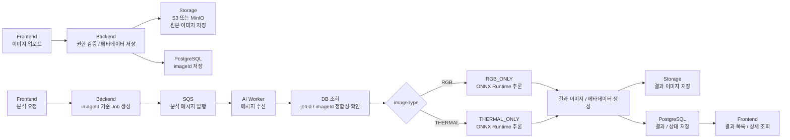

# PV-Insight

RGB 이미지와 열화상 이미지를 각각 독립적으로 분석하는 **태양광 발전소 이상 후보 선별 및 유지보수 지원 플랫폼**입니다.

이미지 기반 AI 분석 결과와 점검 이력, 조치 후보, 우선순위 정보를 결합해 관리자가 **청소, 재촬영, 현장 점검, 교체 검토** 대상을 빠르게 판단할 수 있도록 지원합니다.

```text
구역 점검 생성 → RGB·열화상 이미지 업로드 → imageId 기준 AI 단건 분석 → 결과 저장 → 조치 후보 / 우선순위 확인

```

## 목차

1. [프로젝트 목적](#1-프로젝트-목적)
2. [시연 동영상](#2-시연-동영상)
3. [웹사이트 링크](#3-웹사이트-링크)
4. [현재 MVP 구현 범위](#4-현재-mvp-구현-범위)
5. [주요 기능](#5-주요-기능)
6. [시스템 구성](#6-시스템-구성)
7. [기술 스택](#7-기술-스택)
8. [시스템 아키텍처](#8-시스템-아키텍처)
9. [프로젝트 구조](#9-프로젝트-구조)
10. [주요 화면](#10-주요-화면)
11. [실행 방법](#11-실행-방법)
12. [로컬 접속 정보 / 포트](#12-로컬-접속-정보--포트)
13. [실행 확인 체크리스트](#13-실행-확인-체크리스트)
14. [API 개요](#14-api-개요)
15. [AI 분석 파이프라인 개요](#15-ai-분석-파이프라인-개요)
16. [문서 지도](#16-문서-지도)
17. [협업 및 개발 컨벤션](#17-협업-및-개발-컨벤션)
18. [참고 / 부록](#18-참고--부록)

---

## 1. 프로젝트 목적

🎯 태양광 발전소의 넓은 구역에서 발생하는 **오염, 음영, 식생 침범, 외관 손상, 핫스팟, 과열 이상**을 웹 기반으로 관리하기 위한 MVP입니다.

본 프로젝트는 단순히 이미지를 업로드하고 이상 여부를 판정하는 데서 끝나지 않고, 분석 결과를 점검 회차와 구역 이력에 연결해 관리자가 다음 유지보수 조치를 판단할 수 있도록 지원하는 것을 목표로 합니다.

| 핵심 목표 | 설명 |
| --- | --- |
| 구역 단위 이상 후보 선별 | 개별 패널 정밀 진단보다 우선 확인이 필요한 발전소 구역을 빠르게 찾습니다. |
| RGB·열화상 독립 분석 | RGB 이미지는 RGB-only 모델로, 열화상 이미지는 Thermal-only 모델로 각각 단건 분석합니다. |
| 결과 이력 관리 | 이미지, 분석 작업, 결과, 검토 상태, 조치 후보를 저장하고 조회합니다. |
| 유지보수 조치 연결 | 청소, 재촬영, 현장 점검, 교체 검토 후보를 결과 화면에서 확인합니다. |
| 운영 우선순위 제공 | 심각도, 조치 후보, 반복 이상 여부를 바탕으로 우선 확인 대상을 정리합니다. |

---

## 2. 시연 동영상

🎬 아래 썸네일을 클릭하면 시연 영상을 시청할 수 있습니다.

<a href="https://drive.google.com/file/d/1OWBfMANCIbXIZ1L6tYj9vuD1K-aaZ6Qb/view?usp=drive_link">
  
</a>

---

## 3. 웹사이트 링크

- 🌐 서비스 URL: https://app.pv-insight.com/

서버가 꺼져 있으면 접속이 제한될 수 있습니다.  
접속이 필요한 경우 담당자에게 문의해 주세요.

- 문의: `bonggyulim728@gmail.com`

---

## 4. 현재 MVP 구현 범위

| 구분 | 내용 |
| --- | --- |
| MVP 중심 범위 | Google 로그인, 사용자 승인, 발전소·구역·점검 관리, RGB·열화상 이미지 업로드, 이미지별 AI 분석 요청, 분석 상태 조회, 결과 목록/상세 조회, 대시보드, 관리자 운영 관리 |
| AI 분석 범위 | RGB 이미지는 `RGB_SINGLE / RGB_ONLY`, 열화상 이미지는 `THERMAL_SINGLE / THERMAL_ONLY` 기준으로 단건 분석 |
| 기반 구조 포함 | Spring Boot Backend, React Frontend, FastAPI AI Worker, PostgreSQL, S3/MinIO, SQS/LocalStack, Docker, K3s, Jenkins/ECR 배포 기반 |
| 부분 구현 / 검증 필요 | 최종 모델 품질 검증, 운영 모델 artifact 공급 방식, 전체 E2E smoke, 실제 배포 도메인/HTTPS, 운영 비용 및 리소스 검증 |
| 향후 확장 | 변화 추적 고도화, 반복 이상 통계, 자동 보고서, 알림, 최종 모델 교체, Fusion 후속 연구 |
| 현재 제외 범위 | Pair 생성·관리, RGB-Thermal Fusion 분석, Fusion 전용 API/DB/Queue/Frontend 기능 |

현재 분석 요청은 점검 전체가 아니라 **업로드된 이미지 한 건의 `imageId`** 기준으로 생성됩니다.

RGB 이미지와 열화상 이미지는 같은 점검 회차에 함께 등록되어 있어도 각각 독립적인 이미지와 분석 작업으로 처리합니다.

세부 기능 정의와 우선순위는 [기능 요구사항](docs/03_requirements-specification.md)과 [정책 정의서](docs/02_policy-definition.md)를 기준으로 관리합니다.

---

## 5. 주요 기능

### 1. RGB·열화상 이미지 단건 분석

- RGB 이미지 업로드 및 미리보기
- 열화상 이미지 업로드 및 미리보기
- 이미지별 AI 분석 요청
- `imageId` 기준 분석 Job 생성
- RGB-only 모델 기반 외관 이상 후보 탐지
- Thermal-only 모델 기반 발열 이상 후보 탐지
- 분석 상태 `QUEUED / RUNNING / SUCCEEDED / FAILED` 조회
- 분석 실패 사유 확인 및 재요청 기반 제공

### 2. 태양광 구역 점검 관리

- 발전소 등록 및 조회
- 발전소 하위 구역 등록 및 조회
- 구역 하위 Array / Panel / Module 구조 관리
- 구역 기준 점검 회차 생성
- 점검별 RGB·열화상 이미지 관리
- 이미지와 검사 대상 위치 연결
- 이전 점검 이력 및 변화 추적 기반 제공

### 3. 분석 결과 및 조치 관리

- 원본 이미지와 결과 이미지 비교
- Bounding Box / Heatmap / Mask 기반 시각화 결과 조회
- 이상 유형, 심각도, 조치 후보 확인
- 청소 후보, 재촬영 후보, 현장 점검 후보, 교체 검토 후보 분류
- 검토 상태 변경
- 조치 후보 수정
- 결과 목록 필터링 및 상세 조회

### 4. 사용자 / 권한 / 운영 관리

- Google OAuth 기반 로그인
- 최초 로그인 사용자 승인 대기 처리
- 관리자 승인 후 서비스 접근 허용
- 일반 사용자 / 관리자 권한 분리
- 관리자 사용자 승인 및 비활성화
- 운영 로그 및 주요 이벤트 관리 기반
- 권한 없는 데이터 접근 차단

---

## 6. 시스템 구성

### 🧱 모듈 역할

| 모듈 | 역할 |
| --- | --- |
| `frontend` | React 기반 사용자 화면, 이미지 업로드 UI, 분석 요청, 분석 상태/결과 조회, 대시보드 표시 |
| `backend` | 인증/인가, 발전소·구역·점검 관리, 이미지 메타데이터 저장, 분석 Job 생성, SQS 메시지 발행, 결과 조회 API |
| `ai-worker` | SQS 메시지 수신, 원본 이미지 로드, ONNX Runtime 추론, 결과 이미지 저장, 결과 메타데이터 반영 |
| `k8s` | Namespace, ConfigMap, Secret 예시, Frontend/Backend/AI Worker Deployment, Service, Ingress 정의 |
| `scripts` | AWS 인프라 생성, inventory, 배포 보조 스크립트 |
| `docs` | 프로젝트 개요, 정책, 요구사항, API, ERD, AI Worker 계약, 배포, 컨벤션 문서 |
| `Jenkinsfile` | 테스트, 빌드, Docker image build, 선택적 ECR push, K3s rollout 준비 |

### 저장소 / 외부 리소스 역할

| 저장소 / 리소스 | 역할 |
| --- | --- |
| AWS RDS PostgreSQL | 사용자, 발전소, 구역, 점검, 이미지 메타데이터, 분석 Job, 분석 결과 저장 |
| PostgreSQL Docker | 로컬 개발용 DB |
| AWS S3 | 운영 원본 이미지, 분석 결과 이미지, 모델 artifact 저장 |
| MinIO | 로컬 개발용 객체 저장소 |
| AWS SQS | 운영 AI 분석 작업 Queue |
| LocalStack SQS | 로컬 개발용 Queue |
| AWS ECR | Frontend, Backend, AI Worker Docker image 저장 |
| CloudWatch Logs | Backend / AI Worker 운영 로그 수집 |
| Kubernetes Secret | 운영 DB, OAuth, Queue, Storage 관련 Secret 주입 |
| ConfigMap | Region, bucket, queue URL, public URL, model manifest path 등 비민감 설정 주입 |

---

## 7. 기술 스택

| 영역 | 기술 |
| --- | --- |
| Frontend |       |
| Spring Backend |       |
| FastAPI AI Worker |       |
| Data / Infra |       |
| Deploy / DevOps |       |

세부 버전은 [기술 스택 및 Dependency 버전 관리](docs/13_development-environment-setup-version-management.md)를 기준으로 관리합니다.

후속 연결 또는 환경 의존 항목:

- 운영 모델 파일과 manifest는 Git과 Docker image에 포함하지 않습니다.
- 운영 AI Worker는 `RGB_MODEL_MANIFEST_PATH`, `THERMAL_MODEL_MANIFEST_PATH` 기준으로 모델 manifest를 참조합니다.
- Fusion 모델과 Pair 데이터는 현재 운영 배포값이 아니라 후속 연구 범위로 분리합니다.

---

## 8. 시스템 아키텍처

<div align="center">
  
</div>

🏗️ 본 프로젝트는 **React Frontend - Traefik Ingress - Spring Boot Backend - AWS SQS - FastAPI AI Worker - AWS 관리형 리소스 계층**으로 구성됩니다.

- **Frontend**는 사용자 화면을 제공하며, 발전소·구역·점검 관리, 이미지 업로드, 분석 요청, 분석 상태/결과 조회, 대시보드 기능을 담당합니다.
- **Traefik Ingress**는 외부 요청을 Frontend와 Backend API로 라우팅합니다.
- **Spring Boot Backend**는 인증/권한 검증, 서비스 데이터 관리, 이미지 메타데이터 저장, 분석 작업 생성 및 결과 조회를 담당합니다.
- **AWS SQS**는 Backend가 생성한 분석 작업을 비동기 Queue로 전달합니다.
- **FastAPI AI Worker**는 SQS 메시지를 수신해 원본 이미지를 읽고, RGB-only 또는 Thermal-only 모델로 ONNX Runtime 추론을 수행합니다.
- **데이터/인프라 계층**은 AWS RDS PostgreSQL, AWS S3, AWS SQS, AWS ECR, CloudWatch Logs, Kubernetes Secret/ConfigMap으로 구성됩니다.

### 주요 요청 흐름

1. 사용자는 Frontend에서 점검을 생성하고 RGB 또는 열화상 이미지를 업로드합니다.
2. Frontend는 Backend Public API만 호출합니다.
3. Backend는 인증/권한과 이미지 메타데이터를 검증한 뒤 원본 이미지를 Storage에 저장합니다.
4. 사용자가 분석을 요청하면 Backend는 `imageId` 기준으로 분석 Job을 생성하고 SQS 메시지를 발행합니다.
5. AI Worker는 SQS 메시지를 수신하고 DB에서 Job과 이미지 메타데이터를 조회합니다.
6. AI Worker는 Storage에서 원본 이미지를 로드하고 이미지 유형에 맞는 단건 모델로 추론합니다.
7. 결과 이미지와 결과 메타데이터가 저장되고, 사용자는 결과 목록/상세 화면에서 확인합니다.

---

## 9. 프로젝트 구조

```text
pv-insight/
  frontend/             React + Vite 클라이언트
  backend/              Spring Boot 메인 API 서버
  ai-worker/            FastAPI AI 분석 Worker
  k8s/                  K3s Namespace, ConfigMap, Secret 예시, Deployment, Service, Ingress
  scripts/              AWS 인프라, 배포, 운영 보조 스크립트
  docker/               로컬 PostgreSQL, MinIO, LocalStack 초기화 보조 파일
  docs/                 프로젝트 개요, 정책, 요구사항, API, ERD, 배포, 컨벤션 문서
  Jenkinsfile           Jenkins CI/CD 파이프라인 정의
  docker-compose.yml    로컬 개발 인프라 / 앱 통합 실행 정의
```

📁 세부 디렉터리 원칙은 [Cloud 배포/운영 설계](docs/12_cloud-deployment-operations-design.md)와 [개발 컨벤션](docs/14_development-convention.md)을 참고합니다.

---

## 10. 주요 화면

🖼️ 주요 화면 미리보기입니다. 미리보기 이미지를 클릭하면 원본 크기로 열립니다.

> 실제 화면 캡처는 `docs/images/` 아래에 직접 추가합니다.

| 미리보기 | 화면 | 목적 |
| --- | --- | --- |
| | 대시보드 | 접근 가능한 발전소, 구역, 점검 현황과 이상 후보 및 조치 우선순위를 요약합니다. |
|  | 결과 상세 | 원본/결과 이미지 비교, 이상 후보 시각화, 조치 후보, 검토 상태를 확인합니다. |

화면 목록과 Frontend 위젯/API 흐름은 [화면 구조 설계](docs/05_page-list.md)와 [Frontend 화면·위젯·버튼·API 구성 정리](docs/15_frontend-page-widget-button-api-specification.md)를 참고합니다.

---

## 11. 실행 방법

▶️ 아래 절차는 Windows PowerShell 기준 로컬 개발 실행 순서입니다.

### 1. 필수 도구 준비

- JDK 17
- Node.js 20 권장
- Python 3.10.x
- Docker Desktop 또는 Docker Engine
- Git
- AWS CLI, kubectl은 운영 배포 검증 시 필요

### 2. 환경 변수 파일 생성

```powershell
Copy-Item .env.example .env
Copy-Item .\frontend\.env.example .\frontend\.env.local
Copy-Item .\ai-worker\.env.example .\ai-worker\.env.local
```

실제 DB 비밀번호, OAuth Client Secret, AWS Key, MinIO/LocalStack credential, JWT/Session Secret은 `.env` 또는 개인 로컬 환경 파일에만 작성하고 Git에 커밋하지 않습니다.  
공유가 필요한 설정은 실제 값이 없는 `.env.example`에만 반영합니다.

### 3. 로컬 인프라 실행

```powershell
docker compose up -d
docker compose ps
```

기본 인프라 서비스:

- `postgres`
- `minio`
- `minio-init`
- `localstack`
- `localstack-init`

Queue 확인:

```powershell
docker compose exec localstack awslocal sqs list-queues --region ap-northeast-2
```

### 4. 전체 Compose 실행

루트 `.env`에 최소한 다음 값을 준비합니다.

```text
VITE_API_BASE_URL=http://localhost:8080/api/v1
AI_WORKER_DATABASE_URI=postgresql://pvfusion:<url-encoded-password>@postgres:5432/pv_fusion_local
AI_WORKER_MODEL_DIR=./ai-worker/models
```

```powershell
docker compose --profile app up -d --build
docker compose ps
```

### 5. Backend 단독 실행

```powershell
$env:GOOGLE_CLIENT_ID="your-google-client-id.apps.googleusercontent.com"
$env:GOOGLE_CLIENT_SECRET="your-google-client-secret"

cd .\backend
.\gradlew.bat bootRun --args="--spring.profiles.active=local"
```

### 6. AI Worker 단독 실행

```powershell
cd .\ai-worker
python -m venv .venv
.\.venv\Scripts\Activate.ps1
pip install -r requirements.txt
uvicorn app.main:app --reload --host 0.0.0.0 --port 8000
```

### 7. Frontend 단독 실행

```powershell
cd .\frontend
npm install
npm run dev
```

운영 배포는 [B 담당 1차 배포 실행 Runbook](docs/21_part-b-first-deployment-runbook.md)과 [Jenkins ECR CI 준비 문서](docs/19_jenkins-ecr-ci-preparation.md)를 참고합니다.

---

## 12. 로컬 접속 정보 / 포트

🔌 로컬 개발 기준 포트입니다. 값은 `.env.example`, `docker-compose.yml`, 서비스 설정 파일을 기준으로 확인합니다.

| 대상 | 로컬 주소 | 비고 |
| --- | --- | --- |
| Frontend | `http://localhost:5173` | Vite dev server |
| Backend API | `http://localhost:8080/api/v1` | Spring Boot Public API |
| Backend Health | `http://localhost:8080/actuator/health` | Actuator health check |
| AI Worker | `http://127.0.0.1:8000` | 로컬 Worker 실행 시 사용 |
| AI Worker Health | `http://127.0.0.1:8000/health` | 기본 health check |
| AI Worker Internal Health | `http://127.0.0.1:8000/internal/health` | 내부 상태 확인 |
| PostgreSQL | `localhost:5432` | 로컬 DB |
| MinIO API | `http://localhost:9000` | 로컬 객체 저장소 |
| MinIO Public | `http://127.0.0.1:9000` | Presigned URL public hostname 기준 |
| LocalStack SQS | `http://localhost:4566` | 로컬 SQS 대체 |

상세 로컬 실행 기준은 [Local Development Guide](docs/00_local-development-guide.md)를 참고합니다.

---

## 13. 실행 확인 체크리스트

- [ ] `docker compose up -d` 실행
- [ ] `docker compose ps`로 PostgreSQL, MinIO, LocalStack 상태 확인
- [ ] `http://localhost:8080/actuator/health`로 Backend health check 확인
- [ ] `http://127.0.0.1:8000/health`로 AI Worker health check 확인
- [ ] `http://127.0.0.1:8000/internal/health`로 AI Worker 내부 상태 확인
- [ ] `http://localhost:5173`으로 Frontend 접속 확인
- [ ] Google OAuth 로컬 설정 확인
- [ ] 최초 로그인 사용자 승인 상태 확인
- [ ] 발전소와 구역 등록 가능 여부 확인
- [ ] 구역 기준 점검 생성 가능 여부 확인
- [ ] RGB 또는 열화상 이미지 업로드 가능 여부 확인
- [ ] 이미지별 분석 요청이 `imageId` 기준으로 생성되는지 확인
- [ ] 분석 상태가 `QUEUED -> RUNNING -> SUCCEEDED/FAILED` 중 하나로 전이되는지 확인
- [ ] 결과 목록과 결과 상세 화면에서 결과 이미지와 조치 후보가 표시되는지 확인
- [ ] 실행하지 않은 테스트를 `Pass`로 기록하지 않았는지 확인

✅ 상세 검증 기준은 [단위테스트 시나리오표](docs/16_unit-test-case-execution-template.md)와 배포 runbook을 참고합니다.

---

## 14. API 개요

🔗 외부 API 기본 prefix는 `/api/v1`입니다.

| 구분 | 예시 기능 |
| --- | --- |
| 인증 / 사용자 | Google 로그인, OAuth callback, 내 정보 조회, 로그아웃 |
| 관리자 사용자 | 승인 대기 회원 조회, 회원 승인, 권한 변경, 사용자 비활성화 |
| 발전소 / 구역 | 발전소 목록/등록/상세/수정, 구역 목록/등록/상세/수정 |
| 하위 설비 | Zone 하위 Array / Panel / Module 구조 조회 및 관리 |
| 점검 | 구역 기준 점검 등록, 점검 목록/상세 조회, 점검 정보 수정 |
| 이미지 | RGB·열화상 이미지 업로드, 이미지 목록/상세, 미리보기, 비활성화 |
| AI 분석 작업 | 이미지 단건 분석 요청, 분석 작업 목록, 작업 상태 조회, 재요청 |
| 분석 결과 | 결과 목록, 결과 상세, 결과 이미지 조회, 검토 상태 변경, 조치 후보 수정 |
| 변화 추적 | 반복 이상, 이전 점검 비교, 악화 여부 조회 |
| 대시보드 | 사용자 대시보드, 조치 유형 통계, 심각도 분포, 기간별 추이 |
| 운영 로그 | 관리자 운영 로그 조회 |

성공 응답은 기본적으로 아래 형식을 따릅니다.

```json
{
  "success": true,
  "data": {},
  "message": "요청이 성공했습니다."
}
```

오류 응답은 아래 형식을 따릅니다.

```json
{
  "success": false,
  "error": {
    "status": 403,
    "code": "FORBIDDEN",
    "message": "접근 권한이 없습니다.",
    "detail": "해당 데이터에 접근할 수 없습니다.",
    "path": "/api/v1/plants/1",
    "timestamp": "2026-06-01T10:00:00+09:00",
    "traceId": "req-20260601-0001"
  }
}
```

상세 엔드포인트, 요청/응답, 권한 기준은 [API 명세서](docs/10_api-specification.md)를 참고합니다.

---

## 15. AI 분석 파이프라인 개요

### 🤖 RGB·열화상 단건 분석 파이프라인



### AI Worker 처리 원칙

- AI Worker는 사용자용 공개 API가 아닙니다.
- Frontend는 AI Worker, SQS, S3/MinIO, RDS/PostgreSQL에 직접 접근하지 않습니다.
- Backend는 `imageId` 기준으로 분석 Job을 생성하고 SQS 메시지를 발행합니다.
- AI Worker는 `jobId`, `imageId`를 기준으로 DB를 다시 조회합니다.
- `inputType=RGB_SINGLE`이면 RGB-only 모델을 사용합니다.
- `inputType=THERMAL_SINGLE`이면 Thermal-only 모델을 사용합니다.
- Pair 생성 여부를 조회하거나 기다리지 않습니다.
- Fusion 모델 라우팅과 Fusion 추론은 현재 운영 파이프라인에 포함하지 않습니다.

AI Worker 세부 계약은 [AI Worker Contract](docs/11_ai-worker-contract.md)를 참고합니다.

---

## 16. 문서 지도

| 문서 | 위치 |
| --- | --- |
| 프로젝트 개요 | [docs/01_project-overview.md](docs/01_project-overview.md) |
| 정책 정의서 | [docs/02_policy-definition.md](docs/02_policy-definition.md) |
| 요구사항 명세 | [docs/03_requirements-specification.md](docs/03_requirements-specification.md) |
| 기능 명세 | [docs/04_feature-specification.md](docs/04_feature-specification.md) |
| 화면 구조 | [docs/05_page-list.md](docs/05_page-list.md) |
| 흐름도 | [docs/06_flow-diagrams.md](docs/06_flow-diagrams.md) |
| 시스템 아키텍처 | [docs/08_system-architecture.md](docs/08_system-architecture.md) |
| ERD | [docs/09_erd.md](docs/09_erd.md) |
| API 명세서 | [docs/10_api-specification.md](docs/10_api-specification.md) |
| AI Worker Contract | [docs/11_ai-worker-contract.md](docs/11_ai-worker-contract.md) |
| Cloud 배포 / 운영 설계 | [docs/12_cloud-deployment-operations-design.md](docs/12_cloud-deployment-operations-design.md) |
| 기술 스택 / Dependency | [docs/13_development-environment-setup-version-management.md](docs/13_development-environment-setup-version-management.md) |
| 개발 컨벤션 | [docs/14_development-convention.md](docs/14_development-convention.md) |
| Frontend 화면·위젯·API | [docs/15_frontend-page-widget-button-api-specification.md](docs/15_frontend-page-widget-button-api-specification.md) |
| 단위테스트 시나리오표 | [docs/16_unit-test-case-execution-template.md](docs/16_unit-test-case-execution-template.md) |
| 환경변수 및 Secret 계약 | [docs/17_environment-variable-secret-contract.md](docs/17_environment-variable-secret-contract.md) |
| Service Docker Image Contract | [docs/18_service-docker-image-contract.md](docs/18_service-docker-image-contract.md) |
| Jenkins ECR CI Preparation | [docs/19_jenkins-ecr-ci-preparation.md](docs/19_jenkins-ecr-ci-preparation.md) |
| Part B 1차 배포 Runbook | [docs/21_part-b-first-deployment-runbook.md](docs/21_part-b-first-deployment-runbook.md) |
| AI Worker v0-dev K3s Rollout | [docs/22_ai-worker-v0-dev-k3s-rollout.md](docs/22_ai-worker-v0-dev-k3s-rollout.md) |

---

## 17. 협업 및 개발 컨벤션

- 브랜치 전략은 `main`, `develop`, `feat/*`, `fix/*`, `docs/*`, `chore/*`, `test/*`를 기준으로 합니다.
- 모든 작업은 `develop` 브랜치에서 분기한 작업 브랜치에서 진행합니다.
- 최종 제출 또는 배포 시 `develop`에서 `main`으로 병합합니다.
- 커밋 메시지는 `type: 작업 내용` 형식을 사용합니다.
- PR은 기능 단위로 생성하고, 변경 내용과 검증 결과를 본문에 정리합니다.
- Frontend는 화면 렌더링과 Backend Public API 호출만 담당합니다.
- Spring Backend는 인증/권한, 서비스 데이터 관리, 분석 Job 생성, SQS 메시지 발행, 결과 조회를 담당합니다.
- FastAPI AI Worker는 Queue 기반 내부 Worker로만 사용하며 외부 공개 API로 노출하지 않습니다.
- API 계약 변경은 문서, DTO, DB, Queue 메시지, Frontend 영향 범위를 먼저 확인한 뒤 반영합니다.
- `.env`, `.env.*`, DB 비밀번호, OAuth Client Secret, AWS Access Key, JWT/Session Secret은 Git에 커밋하지 않습니다.
- 모델 대용량 파일(`*.pt`, `*.onnx`, `*.ckpt`)은 Git에 커밋하지 않습니다.
- 대용량 모델 파일은 Docker Image에 포함하지 않습니다.
- Pair/Fusion 관련 코드는 현재 운영 기능처럼 작성하지 않습니다.
- 실제 실행하지 않은 테스트를 `Pass`로 기록하지 않습니다.

🤝 상세 규칙은 [개발 컨벤션](docs/14_development-convention.md)을 참고합니다.

---

## 18. 참고 / 부록

- [Frontend README](frontend/README.md)
- [Backend README](backend/README.md)
- [AI Worker README](ai-worker/README.md)
- [K8s README](k8s/README.md)
- [Docs Index](docs/README.md)

📎 운영 배포 전에는 다음 항목을 확인합니다.

- `git status`
- 변경 파일 목록
- 환경 변수 템플릿
- Secret 포함 여부
- 모델 파일 포함 여부
- Docker build 결과
- ECR push 결과
- K3s apply 결과
- Backend health check
- AI Worker health check
- Frontend 접속 확인
- S3 / SQS / RDS 연결 smoke
- 업로드부터 결과 조회까지 smoke 검증
